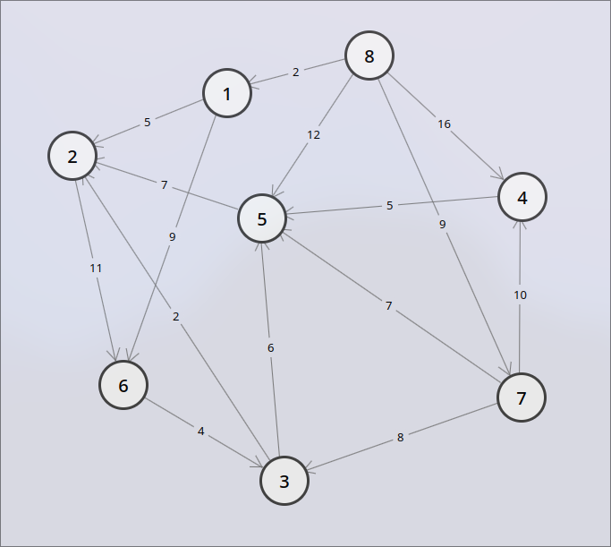
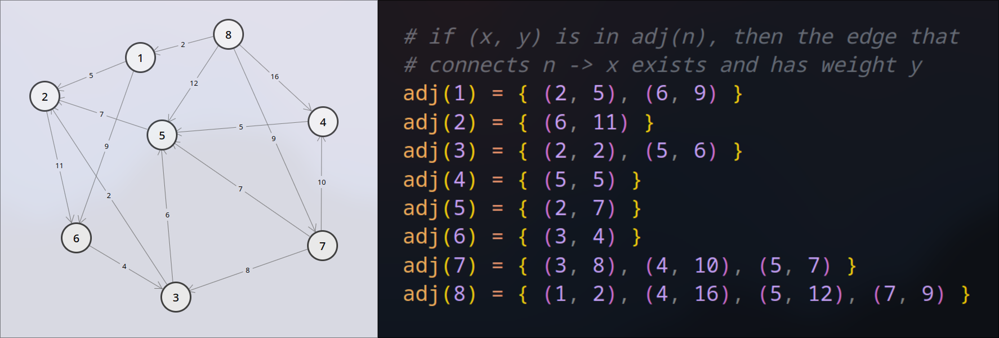
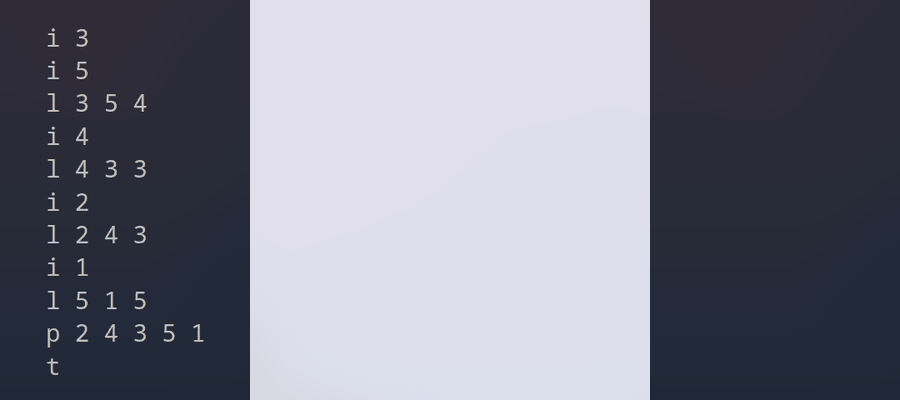

[](https://classroom.github.com/a/5MZ3R2v9)
# Lab 5 - Dynamic Memory Allocation

This lab is due on **Sunday October 27, 2024 at 23:59 MDT**.

Submit what you have to GitHub classroom by pushing to your assignment repository.

Note that GitHub Classroom's due date is in UTC time zone, not MDT.

## Intro
After satisfactory results for replicating existing games last week, your new game studio (name pending) begins work on their first ambitious game. You aspire to make the most grand, open world, story driven, massively multiplayer, epic action adventure experience, with memorable and engaging character development, and where your choices matter. To keep track of those choices and the relationship between hundreds of thousands of characters and factions, you call on your contacts from your research days, who advice you to turn to graph theory.

In this lab, you will be implementing a graph in C that can handle many types of operations.

## Graphs
Graphs are a common data structure, which you will learn much about in CMPUT 204. Graphs consist of a set of **nodes**, which can be connected to other nodes by **edges**.



Each **node** has a unique ID used to identify it. In this lab, each ID is a non-negative integer.

An **edge** is a connection from one node to another. In this lab, each edge should store 3 pieces of information:
1. The source node ID
2. The destination node ID
3. Weight

You will be working with **directed** graphs, meaning each edge is strictly one-directional. We are also working with **weighted** graphs, meaning each edge has a weight value. In this lab, all weights will be integers $>0$. Just like node IDs, edge weights will be given through input.

Input specifications are given in a later section.

## Graph Representation

In general, there are two possiblilities for keeping track of edges:
- **Adjacency List:** A collection of nodes where each node is associated with a list of its neighboring nodes, along with the weights of the edges that connect them
- **Adjacency Matrix:** A square matrix (2D array) where each cell at row `i` and column `j` holds the weight of the edge between node `i` and node `j`, or `0` if no edge exists.

The adjacency matrix approach is far simpler to implement, and faster to access. However, when we have a huge number of nodes, but the majority only have a few connections, the memory usage can be prohibitively expensive. Let's compare both methods:
- **Adjacency List:** Each node ID is represented as a 32-bit (4 byte) integer, and a 64-bit (8 byte) pointer to its sublist, with a 4 byte integer storing either the length of the sublist, or a terminating character. For $1,000,000$ nodes, that is $16,000,000$ bytes, or $16$ MB. An edge is represented by two integers: the destination and the weight. That's another 8 bytes per edge. If each node has, on average, even $100$ edges, that's another $1,000,000 \times 100 \times 8 = 800$ MB. Any modern computer can handle that with ease.
- **Adjacency Matrix:** If we represent each edge as 1 integer (the weight) in an $n\times n$ 2D array, for $1,000,000$ nodes, we need $4 \times 1,000,000^{2} = 4 \times 10^{12}$ bytes, or $4$ **terabytes** of memory. *Yikes*!

Obviously, we will be using the list approach. Since you do not know in advance how many edges a node will have at any given time, **you must use dynamic memory allocation**. To make things easier, we guarantee the node IDs will be between $0$ and a reasonable number so you can index a list of sublists with the IDs directly. You cannot do this with each nodes' adjacency list (since that is just the memory devouring 2D array).

---

**Ajacency list example:**



**Note:** The above representation is purely visual. You may represent adjacency lists as 2D arrays, parallel arrays, etc. However, your representation **must use dynamic arrays**.

## Input

The input will be given through file redirection just as previous labs. It will contain an untedermined number of lines, each of which is a command representing an operation acting on a graph. The input terminates on a termination command `t`.

The operations described by the commands have the ability to create and delete edges and nodes, they can check if a node or edge exists, an they can even traverse the graph. 

Apart from carrying out the appropriate task, your program should provide one output for each command (except for the program termination command `t`). The output should be written to `stdout`.

Below we specify each command's structure, the task your program should carry out when provided with the command, and the output your program should give.

It is safe to assume that all input given will be one of these commands.

**Checking if a node exists:**
- **Command:** `n <id>`
- **Task:** Check if the node with ID `id` exists in the graph.
- **Output:** `1` if the node exists, `0` otherwise.

**Checking if an edge exists:**
- **Command:** `e <source_id> <dest_id>`
- **Task:** Check if the edge connecting `source` to `dest` exists in the graph. Where `source` and `dest` have IDs `source_id` and `dest_id` respectively. Both `source` and `dest` must also exist.
- **Output:** `1` if the edge exists, `0` otherwise.

**Inserting a node:**
- **Command:** `i <id>`
- **Task:** Insert a node with ID `id` into the graph if it doesn't already exist.
- **Output:** `1` if the node was added successfully, `0` if the a node with ID `id` already existed in the graph.

**Inserting or updating an edge:**
- **Command:** `l <source_id> <dest_id> <weight>`
- **Task:** Add an edge with weight `weight` connecting `source` to `dest`. Where `source` and `dest` have IDs `source_id` and `dest_id` respectively. If the edge already exist in the graph, then update its weight.
- **Output:** `1` the edge was added or updated successfully, `0` otherwise.
- **Note:** An edge cannot be added if `source` or `dest` don't exist. An edge should not be added if `source` equals `dest`, i.e. an node cannot be connected to itself.

**Removing an edge:**
- **Command:** `r <source_id> <dest_id>`
- **Task:** Remove the edge connecting `source` to `dest` if it exists. Where `source` and `dest` have IDs `source_id` and `dest_id` respectively.
- **Output:** `1` if the edge existed and the removal was successful, `0` if the edge did not exist.

**Removing a node:**
- **Command:** `d <id>`
- **Task:** Remove node with ID `id` from the graph if it exists. On removal, you must also remove all edges leading to and from this node.
- **Output:** `1` if the node existed and the removal was successful, `0` if the node did not exist.

**Traversing a path:**
- **Command:** `p <id_1> <id_2> ... <id_K>`
- **Arguments:** Assume `K` is at least $2$, i.e. there is at least one edge in the path.
- **Task:** Traverse the path made by the edges linking `node_1` to `node_2`, `node_2` to `node_3`, ..., `node_K-1` to `node_K`, adding up all the edge weights if they all exist. Where `node_X` has ID `id_X`.
- **Output:** The sum of the weights of the edges traversed as an integer. `-1` if the path does not exist. A path does not exist when at least one of the expected edges or nodes is missing.

**Terminating the program:**
- **Command:** `t`
- **Task:** Terminate the program, freeing all allocated memory. **50% marks will be deducted for any memory leaks on every mark case**.
- **Output:** N/A

Each parameter enclosed in `<>` above is an integer that can be stored using `int` in the lab machines.

You can assume that each integer corresponding to a node ID in the input will be non-negative, and that each integer corresponding to an edge weight in the input will be $>0$.

You can also assume that each line will be one of the above commands in the correct format, and that `t` will always be at the end.

## Implementation

This lab provides you with $9$ function prototypes. Each of which will be implemented by you.

### Graph

The way the graph is represented is up to you. However, make sure that it can be **accessed globally** since it will need to be updated and read throughout your program.

As a reminder, here is everything your graph should store:

1. Every node ID.
2. Every edge, where each edge should store
    1. Source node ID
    2. Destination node ID
    3. Weight

The graph will be frequently expanded and shrunk to undetermined sizes, this is why your implementation should be dynamic.

Expect that the representation may use multiple arrays, single or two-dimensional. However the exact implementation is up to you.

### Template Code

Inside the template file `src/ex5q1.c` you're provided with a working main function that handles all input. Furthermore, there are $9$ functions required to be implemented by you, the prototypes for these functions are given in this template file.

Details about what these functions should do, as well as details regarding the main function are given in the next three sections.

**DO NOT EDIT OR CHANGE THE DECLARATION OF ANY OF THE 9 FUNCTIONS IN ANY WAY**, they will be used to test and mark your lab. Any changes made and your program will fail to be tested or graded. However, you may (and are encouraged to) implement functions of your own.

### Graph Operations

The first $7$ function prototypes correspond to one of the commands described in the [input section](#input) (excluding `t`).

Each function should carry out the task specified by its corresponding command, as well as return the correct output value. Check the [input section](#input) to view the task and output value of each command.

Here are the prototypes given for command handling:

```C
int nodeExists(int id);
int edgeExists(int source_id, int dest_id);
int insertNode(int id);
int insertEdge(int source_id, int dest_id, int weight);
int removeEdge(int source_id, int dest_id);
int removeNode(int id);
int path(int source_d);
```

The following table shows which function corresponds to which command

| Function Name | Command |
| ------------- | ------- |
| `nodeExists`  | `n`     |
| `edgeExists`  | `e`     |
| `insertNode`  | `i`     |
| `insertEdge`  | `l`     |
| `removeEdge`  | `r`     |
| `removeNode`  | `d`     |
| `path`        | `p`     |

The order of the arguments are the same for each function and their respective command. However, `path` is the exception: it is only given the first of an undetermined number of node IDs, it should read input to get the rest of the path, one node ID at a time (again, you can assume that paths given through input will always contain non-negative integers as node IDs).

### Starting and Ending Functions

You're also provided with $2$ more function prototypes:

```C
void start();
void end();
```

`start` will run once before anything else. `end` will run once right before the program successfully terminates, that is, `end` is called right before `return 0;` in the main function.

It is recommended to initialize what you need in `start`, and free all memory in `end`.

## Input Handling

The purpose of this lab is for you to get comfortable with memory management. For this reason, you won't need to worry about input handling in this lab (except for the `path` implementation).

You are given a working input loop in `main` that will:

1. Read input from `stdin`.
2. Identify each graph command and its arguments.
3. Call the function corresponding to the given graph command with the correct arguemnts.
4. Write the function's return value to `stdout`.
5. Terminate when encoutering the program termination command `t`.

This means that you will just need to implement the functions described above, nothing else. The given input loop will identify each command and write output.

**Important:** The main function given in the template code is fully functional and should not be edited. Only write your code inside the definitions of all $9$ of the provided functions, as well as any additional functions you create.

## Example I/O

### Example 1

Input:
```
i 3
i 5
l 3 5 4
i 4
l 4 3 3
i 2
l 2 4 3
i 1
l 5 1 5
p 2 4 3 5 1
t
```

Output:
```
1
1
1
1
1
1
1
1
1
15
```

Visual:



### Example 2

Input:
```
i 1
i 2
i 3
l 1 2 1
l 2 3 2
l 3 4 3
p 1 2 3
d 2
p 1 2 3
t
```

Output:
```
1
1
1
1
1
0
3
1
-1
```

### Example 3

Input:
```
i 1
e 1 2
i 4
d 3
n 4
l 4 1 5
i 5
p 4 1
d 4
l 1 5 1
n 4
i 9
p 4 1 5
l 5 9 10
p 1 5 9
r 1 5
e 1 5
p 5 9
t
```

Output:
```
1
0
1
0
1
1
1
5
1
1
0
1
-1
1
11
1
0
10
```

## Memory Leaks and Valgrind

As stated above, your program should terminate without any memory leaks. Leaking memory will cost you marks for this lab (details in the [marking scheme section](#marking-20-pts)). To check for memory leaks, you will use Valgrind.

Valgrind is a tool that will help you spot any memory leaks in a program. To use it, simply run `valgrind <command>` where `<command>` will is the command used to execute your program.

**Example**

If you compile your program in this way: `gcc -Wall -Werror -std=c99 src/ex5q1.c -o src/ex5q1`. Then instead of running the executable by using `./src/ex5q1`, you instead will run `valgrind ./src/ex5q1`.

In order to determine whether your program leaked any memory or not, check the Valgrind summary section which is printer after the program finished running. It should look something like this:

```
...
==3820== HEAP SUMMARY:
==3820==     in use at exit: 0 bytes in 0 blocks
==3820==   total heap usage: 1 allocs, 1 frees, 40 bytes allocated
==3820== 
==3820== All heap blocks were freed -- no leaks are possible
==3820== 
==3820== For lists of detected and suppressed errors, rerun with: -s
==3820== ERROR SUMMARY: 0 errors from 0 contexts (suppressed: 0 from 0)
```

If `HEAP SUMMARY` reports `in use at exit: 0 bytes in 0 blocks` (like the example above), then you are NOT leaking any memory.

If `HEAP SUMMARY` reports `in use at exit: X bytes in Y blocks` where `X` or `Y` are not `0`, then you are leaking memory.

Ignore `LEAK SUMMARY` if it shows up, only worry about `HEAP SUMMARY` for this lab.

If Valgrind reports any error messages during the execution of your program, then you can find out what they mean and how to fix them in the [Valgrind error messages documentation](https://valgrind.org/docs/manual/mc-manual.html#mc-manual.errormsgs). Being able to read these error messages will make debugging your code for memory leaks much easier.

## Checking
As always: You are provided with a script that checks your program named `check.sh`, this script will compare your program's output to the expected output. To pass `check.sh`, your program's output should be an exact match to the expected output for all inputs given. All of the test cases that `check.sh` takes into account are provided in the `Testcases` directory.

In order to run this script first run this command to grant it proper permissions:

`chmod 700 check.sh`

Then to run the script run the command:

`./check.sh`

Read the output for more details should you fail any test cases or fail compilation.

**You are guaranteed a 50% minimum on this lab if you pass this script.**

Important: Make sure all your source code is inside of the source directory `src` and all files are named appropriately (`exAq1.c`, `exAq2.c`, etc. where `A` is the lab number).

Note: `check.sh` will fail on any memory leaks.

## Marking (20 pts)

If `check.sh` passes:
- Pass `check.sh` (10 pts).
- Pass mark cases (10 pts).

If `check.sh` fails:
- Pass mark cases (20 pts).

**Memory Leaks:**
- If your program passes a mark case but leaks memory, 50% of the points that mark case is worth will be deducted.
